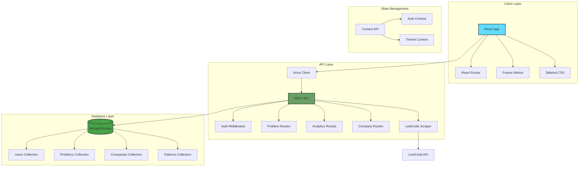
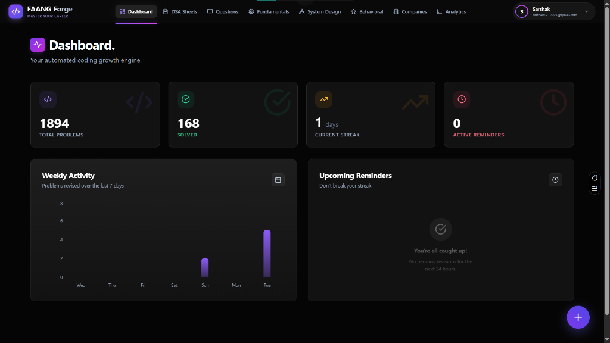
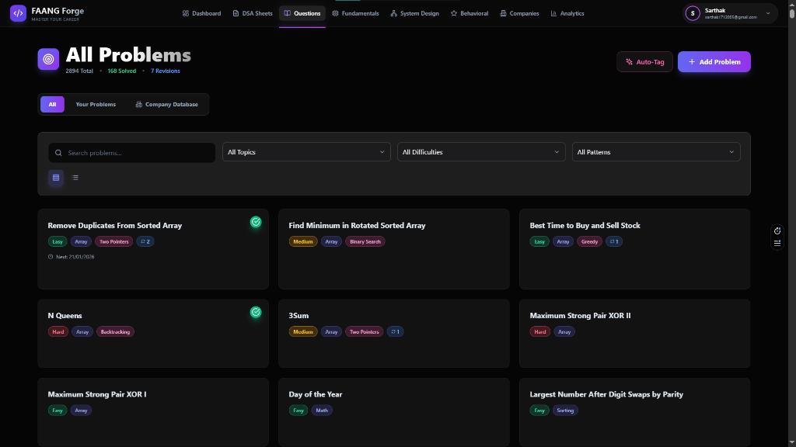
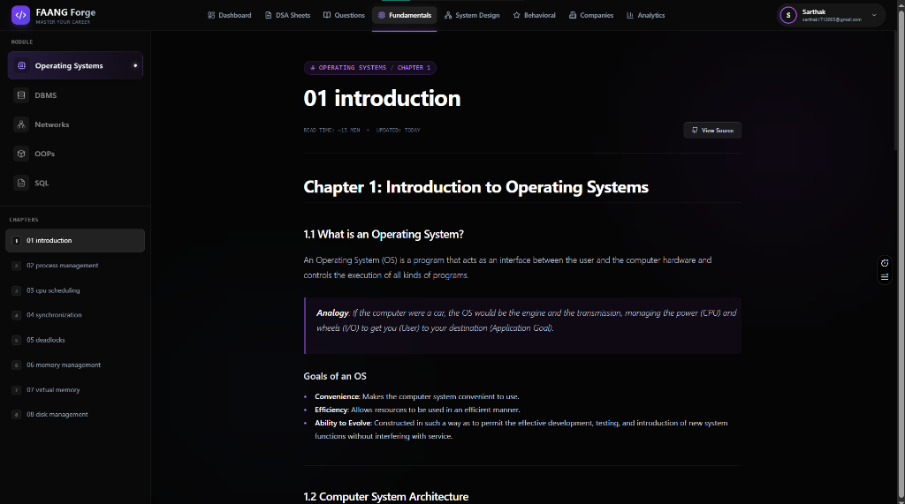
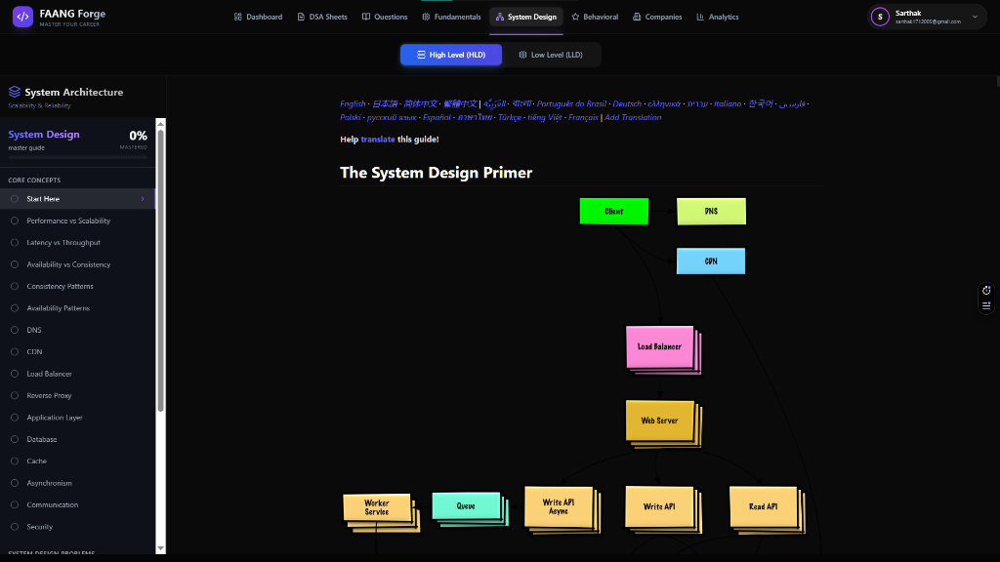
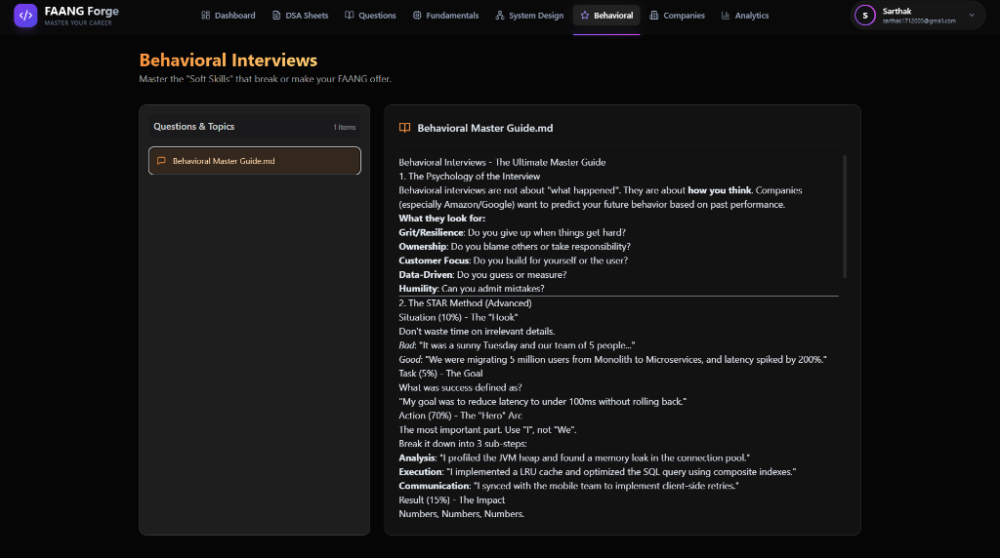
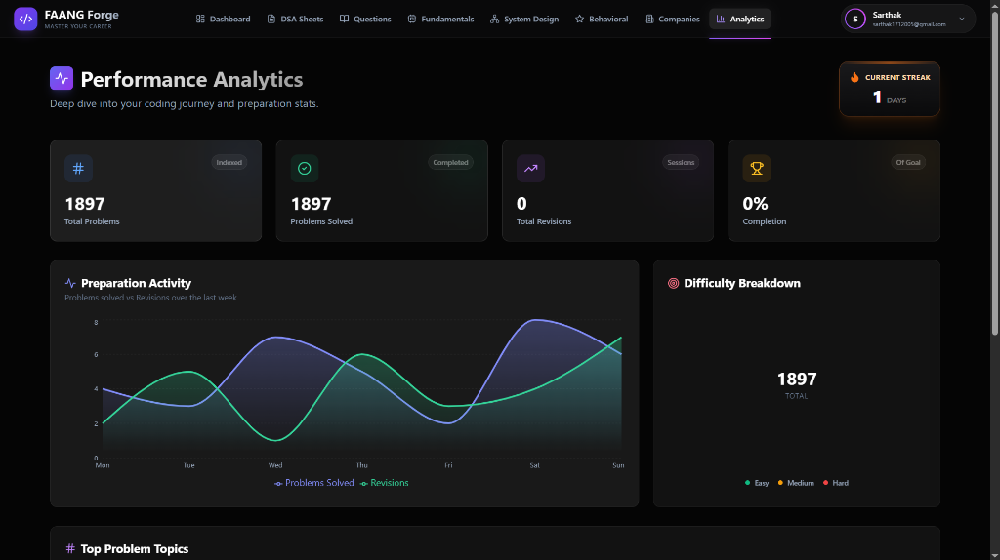

# 🚀 FAANG Forge - Premium Interview Prep Platform

<div align="center">


**A premium, full-stack DSA revision platform with spaced repetition, pattern recognition, and comprehensive Low-Level Design learning**

[Live Demo](https://algo-flow-khaki.vercel.app/) • [Report Bug](https://github.com/iam-sarthakdev/AlgoFlow/issues) • [Request Feature](https://github.com/iam-sarthakdev/AlgoFlow/issues)

</div>

---

## 📌 Table of Contents

- [Overview](#-overview)
- [Features](#-features)
- [Tech Stack](#-tech-stack)
- [Architecture](#-architecture)
- [Project Structure](#-project-structure)
- [Getting Started](#-getting-started)
- [API Documentation](#-api-documentation)
- [Database Schema](#-database-schema)
- [Deployment](#-deployment)
- [Screenshots](#-screenshots)
- [Contributing](#-contributing)
- [License](#-license)

---

## 🎯 Overview

**FAANG Forge** is an intelligent DSA interview preparation platform designed to help developers master coding interviews through:
- **Spaced Repetition**: Scientifically-proven scheduling algorithm for long-term retention
- **Pattern Recognition**: Automatic categorization of 14+ common DSA patterns
- **Company-Specific Practice**: 2892+ problems from 20+ FAANG & top-tier companies
- **Comprehensive LLD**: In-depth Low-Level Design content with real-world case studies
- **Smart Analytics**: Visual insights into your preparation journey

Built with a premium glassmorphic UI and enterprise-grade architecture, FAANG Forge transforms how developers prepare for technical interviews.

---

## ✨ Features In-Depth

### 🧠 **Intelligent Problem Management**

#### Spaced Repetition Algorithm
Based on the **Ebbinghaus Forgetting Curve**, our algorithm schedules optimal review times:

```
Day 1  → First Revision
Day 3  → Second Revision  
Day 7  → Third Revision
Day 14 → Fourth Revision
Day 30 → Fifth Revision
Day 60 → Sixth Revision
Day 90 → Final Consolidation
```

**How it works:**
1. When you mark a problem as "Revised", the system calculates the next optimal review date
2. Problems appear in your "Upcoming Reminders" based on this schedule
3. Consistent revision moves problems to longer intervals (strength building)
4. Missing a revision resets the interval (retention recovery)

#### Auto-Pattern Recognition
The system automatically tags problems with 14+ common DSA patterns:

| Pattern | Keywords | Common Problems |
|---------|----------|-----------------|
| Two Pointers | "pair", "palindrome", "sorted" | Two Sum, Container With Water |
| Sliding Window | "substring", "contiguous", "window" | Longest Substring, Max Sum Subarray |
| Binary Search | "sorted", "rotated", "find" | Search in Rotated Array |
| BFS/DFS | "path", "level", "traverse" | Word Ladder, Number of Islands |
| Dynamic Programming | "maximum", "minimum", "ways" | Climbing Stairs, Coin Change |
| Backtracking | "permutation", "combination", "subset" | N-Queens, Subsets |

#### LeetCode Integration
```javascript
// Automatic problem fetching
const fetchProblemDetails = async (leetcodeUrl) => {
  // Extract problem slug from URL
  // Query LeetCode GraphQL API
  // Return: title, description, examples, constraints
};
```

---

### 📋 **Curated DSA Sheets**

#### Available Sheets

##### 1. NeetCode 150 (150 Problems)
The gold standard for FAANG preparation, covering:
- Arrays & Hashing (9 problems)
- Two Pointers (5 problems)
- Sliding Window (6 problems)
- Stack (7 problems)
- Binary Search (7 problems)
- Linked List (11 problems)
- Trees (15 problems)
- Heap/Priority Queue (7 problems)
- Backtracking (9 problems)
- Tries (3 problems)
- Graphs (13 problems)
- Advanced Graphs (6 problems)
- 1-D Dynamic Programming (12 problems)
- 2-D Dynamic Programming (11 problems)
- Greedy (8 problems)
- Intervals (6 problems)
- Math & Geometry (8 problems)
- Bit Manipulation (7 problems)

##### 2. Striver's A2Z DSA Course (455+ Problems)
Complete A2Z roadmap covering:
- Basics → Arrays → Strings → Recursion → Backtracking
- Binary Search → Linked List → Stacks & Queues
- Trees → Graphs → Dynamic Programming

##### 3. NeetCode All (250 Problems)
Extended collection beyond Blind 75:
- Additional medium/hard problems by pattern
- Interview favorites from top companies
- Edge cases and variations

##### 4. Love Babbar 450 (370+ Problems)
Famous sheet for Indian placement season:
- Arrays, Matrix, Strings, Searching & Sorting
- Linked List, Binary Trees, BST, Heaps
- Graphs, Stack & Queues, DP, Backtracking

#### Custom List (Sarthak's List)
Your personalized collection with:
- **Drag-and-Drop Reordering**: Prioritize problems you want to focus on
- **Pattern Sections**: Organize by DSA pattern
- **Progress Tracking**: Mark problems as complete
- **Notes Integration**: Add personal notes to each problem

---

### 📊 **Advanced Analytics Dashboard**

#### Metrics Tracked

| Metric | Description | Visualization |
|--------|-------------|---------------|
| **Total Problems** | All problems in your list | Counter card |
| **Solved** | Problems marked as complete | Counter with percentage |
| **Current Streak** | Consecutive days with revisions | Flame icon + counter |
| **Active Reminders** | Problems due for review | Clock icon + counter |

#### Visualizations

**Weekly Activity Chart**: Bar chart showing problems revised per day
```
Mon: ████ (8)
Tue: ██ (4)
Wed: ██████ (12)
Thu: ███ (6)
Fri: ███████ (14)
Sat: █ (2)
Sun: ████ (8)
```

**Difficulty Breakdown**: Pie chart with Easy (Green), Medium (Yellow), Hard (Red)

**Topic Distribution**: Bar chart of problems per data structure

---

### 🏢 **Company-Specific Preparation**

#### Company Database Statistics

| Tier | Companies | Total Problems |
|------|-----------|----------------|
| **FAANG** | Google, Amazon, Meta, Apple, Netflix, Microsoft | 4,200+ |
| **Top Tier** | Uber, Airbnb, LinkedIn, Twitter, Salesforce | 2,100+ |
| **Fintech** | Goldman Sachs, Bloomberg, DE Shaw, Citadel | 1,400+ |

#### Features
- **Company Search**: Find any company instantly
- **Problem Filtering**: Filter by difficulty within each company
- **Quick Import**: One-click add to your personal list
- **Tag Badges**: FAANG (gold) vs Top Tier (silver) indicators

---

### 📚 **CS Fundamentals (Core Subjects)**

#### Operating Systems
| # | Chapter | Topics Covered |
|---|---------|----------------|
| 1 | Introduction | OS goals, types, architecture |
| 2 | Process Management | Process states, PCB, context switching |
| 3 | CPU Scheduling | FCFS, SJF, RR, Priority, MLFQ |
| 4 | Synchronization | Race conditions, mutex, semaphores |
| 5 | Deadlocks | Prevention, avoidance, detection |
| 6 | Memory Management | Paging, segmentation, virtual memory |
| 7 | Virtual Memory | Page replacement, thrashing |
| 8 | Disk Management | Scheduling algorithms, RAID |

#### DBMS
- Relational Model, SQL, Normalization
- Transactions, ACID, Concurrency Control
- Indexing, Query Optimization

#### Networks
- OSI Model, TCP/IP, HTTP/HTTPS
- Routing Protocols, DNS, Load Balancing

---

### 🏗️ **System Design (HLD/LLD)**

#### High-Level Design Topics
- Performance vs Scalability
- CAP Theorem, Consistency Patterns
- Load Balancers, CDN, Caching
- Database Sharding, Replication
- Message Queues, Microservices

#### Low-Level Design Topics
| Chapter | Topic |
|---------|-------|
| 1 | Introduction to LLD |
| 2-6 | SOLID Principles (SRP, OCP, LSP, ISP, DIP) |
| 7-15 | GRASP Principles |
| 13 | Case Study: Parking Lot System |
| 14 | Case Study: Library Management |

---

### 🎨 **Premium UI/UX Design**

#### Design Philosophy
We follow a **Glassmorphic Dark Theme** with:

```css
/* Core design tokens */
--glass-bg: rgba(255, 255, 255, 0.05);
--glass-border: rgba(255, 255, 255, 0.1);
--blur: backdrop-blur(10px);
--gradient-accent: linear-gradient(135deg, #6366f1, #8b5cf6);
```

#### Animation Principles
- **Staggered Entry**: Cards appear sequentially (100ms delay)
- **Spring Physics**: Natural, bouncy hover effects
- **Exit Animations**: Smooth fade-out when removing elements

#### Accessibility
- Keyboard navigation support
- Screen reader friendly labels
- Color contrast ratios > 4.5:1
- Focus indicators on interactive elements

---

## 🛠 Tech Stack & Architecture Decisions

### **Why MERN Stack?**

We chose the **MERN stack** (MongoDB, Express.js, React, Node.js) for several strategic reasons:

| Factor | Benefit |
|--------|---------|
| **JavaScript Everywhere** | Single language across frontend and backend reduces context switching |
| **JSON Native** | MongoDB stores JSON-like documents, React uses JSON, seamless data flow |
| **NPM Ecosystem** | Access to millions of packages for rapid development |
| **Real-time Capable** | Node.js event-driven model supports future real-time features |
| **Industry Standard** | MERN skills are highly demanded in FAANG interviews |

---

### **Frontend Technologies**

#### **React 18** - UI Library
```
Why React over Vue/Angular?
├── Component-based architecture for reusability
├── Virtual DOM for optimal performance
├── Largest ecosystem and community support
├── Hooks API for cleaner state management
└── Easy integration with other libraries
```

**Key Features Used:**
- `useState`, `useEffect`, `useContext` hooks
- Custom hooks for API calls and authentication
- React.memo for performance optimization
- Suspense for code splitting

#### **React Router v6** - Client-Side Routing
- **Nested Routes**: Clean URL structure (`/problems/:id`)
- **Protected Routes**: Authentication-based access control
- **useNavigate**: Programmatic navigation after form submissions
- **useLocation**: Access current URL params for deep linking

#### **Framer Motion** - Animation Library
```javascript
// Example: Staggered card animations
const containerVariants = {
  hidden: { opacity: 0 },
  visible: { 
    opacity: 1,
    transition: { staggerChildren: 0.1 }
  }
};
```
**Why Framer Motion?**
- Declarative animations with React integration
- Physics-based spring animations
- AnimatePresence for exit animations
- Layout animations for smooth transitions

#### **Tailwind CSS** - Styling
**Why Tailwind over CSS-in-JS or Sass?**
| Approach | Tailwind Advantage |
|----------|-------------------|
| Traditional CSS | No naming conflicts, no separate files |
| CSS Modules | Faster development with utility classes |
| Styled Components | Smaller bundle size, no runtime overhead |

**Custom Extensions:**
- Glassmorphic card effects with `backdrop-blur`
- Custom color palette for dark mode
- Responsive breakpoints for mobile-first design

#### **Recharts** - Data Visualization
- Built specifically for React (not a wrapper)
- Composable chart components
- Responsive container support
- Smooth animations out of the box

Used for:
- Weekly activity line charts
- Difficulty distribution pie charts
- Topic breakdown bar charts

#### **@dnd-kit** - Drag and Drop
- Lightweight alternative to react-beautiful-dnd
- Accessibility built-in (keyboard support)
- Smooth animations during drag
- Sortable lists for problem reordering

---

### **Backend Technologies**

#### **Node.js** - Runtime Environment
```
Why Node.js?
├── Non-blocking I/O for handling concurrent requests
├── Same language as frontend (JavaScript)
├── Excellent for I/O-heavy operations (database, API calls)
├── NPM package ecosystem
└── Easy deployment on modern platforms
```

#### **Express.js** - Web Framework
**Middleware Architecture:**
```javascript
// Request Flow
Request → cors() → json() → authenticate() → Route Handler → Response
```

**Key Middleware Used:**
- `express.json()` - Parse JSON bodies
- `cors` - Cross-Origin Resource Sharing
- Custom `authenticate` - JWT verification
- Error handling middleware - Centralized error responses

#### **MongoDB** - Database
**Why NoSQL over SQL?**
| Factor | MongoDB Advantage |
|--------|------------------|
| **Schema Flexibility** | Problems can have varying fields (hints, companies, patterns) |
| **JSON Storage** | Direct mapping to JavaScript objects |
| **Horizontal Scaling** | Easy sharding for future growth |
| **Aggregation Pipeline** | Powerful analytics queries |
| **Document Relationships** | Embedded documents for related data |

**Collections Structure:**
```
faang-forge-db/
├── users              # User accounts and preferences
├── problems           # User's personal problem list
├── companyproblems    # Shared company-tagged problems (7700+)
├── problemlists       # Curated sheets (NeetCode, Striver, etc.)
├── revisions          # Revision history for spaced repetition
└── patterns           # DSA pattern definitions
```

#### **Mongoose** - ODM (Object Document Mapper)
```javascript
// Schema with validation, virtuals, and middleware
const problemSchema = new Schema({
  title: { type: String, required: true, maxlength: 200 },
  difficulty: { type: String, enum: ['Easy', 'Medium', 'Hard'] },
  patterns: [{ type: String }],  // Array of pattern tags
  next_reminder_date: Date,      // Spaced repetition
  revision_count: { type: Number, default: 0 }
}, { timestamps: true });
```

**Features Used:**
- Schema validation
- Pre/post hooks for password hashing
- Virtual properties
- Population for references
- Aggregation pipelines

#### **JWT (JSON Web Tokens)** - Authentication
```
Authentication Flow:
1. User logs in with email/password
2. Server validates credentials
3. Server generates JWT with userId
4. Client stores JWT in localStorage
5. Client sends JWT in Authorization header
6. Server middleware verifies JWT on protected routes
```

**Token Structure:**
```javascript
{
  userId: "ObjectId",
  email: "user@example.com",
  iat: 1234567890,
  exp: 1234567890 + 7 days
}
```

#### **Bcrypt** - Password Security
- Salted hashing (prevents rainbow table attacks)
- Configurable work factor (10 rounds)
- Async operations (non-blocking)

---

### **Deployment Infrastructure**

#### **Vercel** - Frontend Hosting
**Why Vercel?**
- Zero-config deployment for React/Vite
- Global CDN for fast asset delivery
- Automatic HTTPS
- Preview deployments for PRs
- Environment variable management

**Build Settings:**
```
Framework: Vite
Build Command: npm run build
Output Directory: dist
```

#### **Render** - Backend Hosting
**Why Render over Heroku?**
- Free tier without cold starts (paid)
- Native Docker support
- Automatic deploys from GitHub
- Built-in environment variables
- Health checks and auto-restart

**Configuration:**
```yaml
Build Command: npm install
Start Command: npm start
Health Check Path: /api/health
```

#### **MongoDB Atlas** - Cloud Database
- Free 512MB cluster
- Automatic backups
- Global regions for low latency
- Built-in monitoring
- IP whitelisting for security

---
| **MongoDB Atlas** | Cloud database |
| **Git & GitHub** | Version control |

---

## 🏗 Architecture



### **Data Flow**

1. **Authentication**: JWT-based auth with httpOnly cookies
2. **Problem Management**: CRUD operations with auto-save
3. **Spaced Repetition**: Server-side calculation of next reminder dates
4. **Analytics**: MongoDB aggregation pipelines for statistics
5. **Pattern Recognition**: Keyword matching algorithm for auto-tagging

---

## 📁 Project Structure

```
FAANG-Forge/
├── client/                      # Frontend React application
│   ├── public/
│   │   └── system-design-data/  # LLD markdown files
│   │       └── lld/
│   │           ├── 01-intro.md
│   │           ├── 02-solid-srp.md
│   │           ├── 13-case-parking-lot.md
│   │           └── ...
│   ├── src/
│   │   ├── components/          # Reusable components
│   │   │   ├── CustomSelect.jsx
│   │   │   ├── Navbar.jsx
│   │   │   └── PageLayout.jsx
│   │   ├── context/             # React Context providers
│   │   │   └── AuthContext.jsx
│   │   ├── pages/               # Route components
│   │   │   ├── DashboardPage.jsx
│   │   │   ├── ProblemsPage.jsx
│   │   │   ├── ProblemDetail.jsx
│   │   │   ├── AnalyticsPage.jsx
│   │   │   ├── SystemDesignPage.jsx
│   │   │   ├── CompaniesPage.jsx
│   │   │   └── LoginPage.jsx
│   │   ├── services/            # API integration
│   │   │   ├── api.js
│   │   │   ├── leetcodeApi.js
│   │   │   └── companyProblemsApi.js
│   │   ├── utils/               # Helper functions
│   │   │   └── constants.js
│   │   ├── styles/
│   │   │   └── theme.js
│   │   ├── App.jsx
│   │   ├── index.css
│   │   └── main.jsx
│   ├── package.json
│   └── vite.config.js
│
├── server/                      # Backend Node.js application
│   ├── src/
│   │   ├── controllers/         # Request handlers
│   │   │   ├── authController.js
│   │   │   ├── problemsController.js
│   │   │   ├── analyticsController.js
│   │   │   ├── companyProblemsController.js
│   │   │   └── leetcodeController.js
│   │   ├── models/              # Mongoose schemas
│   │   │   ├── User.js
│   │   │   ├── Problem.js
│   │   │   └── CompanyProblem.js
│   │   ├── routes/              # API routes
│   │   │   ├── auth.routes.js
│   │   │   ├── problems.routes.js
│   │   │   ├── analytics.routes.js
│   │   │   └── companyProblems.routes.js
│   │   ├── middleware/          # Express middleware
│   │   │   └── auth.js
│   │   ├── config/
│   │   │   └── db.js
│   │   ├── data/                # Seed data
│   │   │   └── companies/
│   │   │       └── [company]-problems.csv
│   │   └── server.js
│   ├── package.json
│   └── .env
│
├── .gitignore
├── README.md
└── LICENSE
```

---

## 🚀 Getting Started

### **Prerequisites**
- Node.js 16+ and npm/yarn
- MongoDB instance (local or Atlas)
- Git

### **Installation**

1. **Clone the repository**
   ```bash
   git clone https://github.com/iam-sarthakdev/AlgoFlow.git
   cd AlgoFlow
   ```

2. **Install dependencies**
   ```bash
   # Install server dependencies
   cd server
   npm install

   # Install client dependencies
   cd ../client
   npm install
   ```

3. **Configure environment variables**

   Create `.env` in the `server` directory:
   ```env
   PORT=5000
   MONGODB_URI=your_mongodb_connection_string
   JWT_SECRET=your_super_secret_jwt_key
   NODE_ENV=development
   ```

   Create `.env` in the `client` directory:
   ```env
   VITE_API_URL=http://localhost:5000
   ```

4. **Seed the database** (Optional)
   ```bash
   cd server
   node src/scripts/seedCompanyProblemsLocal.js
   ```

5. **Run the application**

   ```bash
   # Terminal 1 - Start backend
   cd server
   npm run dev

   # Terminal 2 - Start frontend
   cd client
   npm run dev
   ```

6. **Access the app**
   
   **Live Production Build:**
   - Frontend: [https://algo-flow-khaki.vercel.app/](https://algo-flow-khaki.vercel.app/)
   
   **Local Environment:**
   - Frontend: `http://localhost:5173`
   - Backend: `http://localhost:5000`


---

## 📡 API Documentation

### **Base URL**
- **Production**: `https://faang-forge-api.onrender.com`
- **Development**: `http://localhost:5000`

### **Authentication Headers**
```javascript
// All protected routes require this header
{
  "Authorization": "Bearer <JWT_TOKEN>",
  "Content-Type": "application/json"
}
```

---

### **Authentication Endpoints**

#### `POST /api/auth/register`
Create a new user account.

**Request Body:**
```json
{
  "name": "Sarthak Dev",
  "email": "user@example.com",
  "password": "securePassword123"
}
```

**Response (201):**
```json
{
  "success": true,
  "message": "User registered successfully",
  "token": "eyJhbGciOiJIUzI1NiIsInR5cCI6IkpXVCJ9...",
  "user": {
    "_id": "507f1f77bcf86cd799439011",
    "name": "Sarthak Dev",
    "email": "user@example.com"
  }
}
```

#### `POST /api/auth/login`
Login with email and password.

**Request Body:**
```json
{
  "email": "user@example.com",
  "password": "securePassword123"
}
```

**Response (200):**
```json
{
  "success": true,
  "token": "eyJhbGciOiJIUzI1NiIsInR5cCI6IkpXVCJ9...",
  "user": {
    "_id": "507f1f77bcf86cd799439011",
    "name": "Sarthak Dev",
    "email": "user@example.com"
  }
}
```

---

### **Problems Endpoints**

#### `GET /api/problems`
Get all user problems with optional filters.

**Query Parameters:**
| Parameter | Type | Description |
|-----------|------|-------------|
| `topic` | string | Filter by topic (Arrays, Trees, etc.) |
| `difficulty` | string | Filter by Easy/Medium/Hard |
| `pattern` | string | Filter by DSA pattern |
| `search` | string | Search in title/topic |
| `sort` | string | Sort field (createdAt, difficulty) |
| `order` | string | asc or desc |
| `page` | number | Page number (default: 1) |
| `limit` | number | Items per page (default: 200) |

**Response (200):**
```json
{
  "problems": [
    {
      "_id": "507f1f77bcf86cd799439011",
      "title": "Two Sum",
      "topic": "Arrays",
      "difficulty": "Easy",
      "url": "https://leetcode.com/problems/two-sum",
      "patterns": ["Hash Map", "Two Pointers"],
      "revision_count": 3,
      "next_reminder_date": "2026-01-25T00:00:00.000Z"
    }
  ],
  "total": 150,
  "page": 1,
  "pages": 1
}
```

#### `POST /api/problems`
Create a new problem.

**Request Body:**
```json
{
  "title": "Two Sum",
  "url": "https://leetcode.com/problems/two-sum",
  "topic": "Arrays",
  "difficulty": "Easy",
  "notes": "Use hash map for O(n) solution",
  "patterns": ["Hash Map"],
  "next_reminder_date": "2026-01-25"
}
```

#### `POST /api/problems/:id/revise`
Mark a problem as revised (updates spaced repetition schedule).

**Spaced Repetition Algorithm:**
```javascript
// Revision intervals (Ebbinghaus curve)
const intervals = [1, 3, 7, 14, 30, 60, 90]; // days

// Next reminder calculation
const revisionCount = problem.revision_count;
const intervalIndex = Math.min(revisionCount, intervals.length - 1);
const nextDate = new Date();
nextDate.setDate(nextDate.getDate() + intervals[intervalIndex]);
```

---

### **Curated Sheets (Problem Lists) Endpoints**

#### `GET /api/lists`
Get all problem lists (curated sheets).

**Response (200):**
```json
{
  "success": true,
  "lists": [
    {
      "_id": "507f1f77bcf86cd799439011",
      "name": "NeetCode 150",
      "description": "The famous Blind 75 + essential patterns",
      "isOfficial": true,
      "sections": [
        {
          "title": "Arrays & Hashing",
          "problems": [
            {
              "title": "Contains Duplicate",
              "url": "https://leetcode.com/problems/contains-duplicate",
              "difficulty": "Easy"
            }
          ]
        }
      ]
    }
  ]
}
```

#### `POST /api/lists/seed-famous` (Admin Only)
Seed the database with famous DSA sheets.

**Protected Route**: Requires admin email (`sarthak1712005@gmail.com`)

**Response (200):**
```json
{
  "success": true,
  "message": "Successfully seeded 4 famous lists",
  "lists": ["NeetCode 150", "Striver's A2Z", "NeetCode All", "Love Babbar 450"]
}
```

---

### **Company Problems Endpoints**

#### `GET /api/companies`
Get all companies with problem counts.

**Response (200):**
```json
{
  "success": true,
  "companies": [
    { "name": "Google", "problemCount": 892, "easy": 150, "medium": 520, "hard": 222 },
    { "name": "Amazon", "problemCount": 756, "easy": 120, "medium": 480, "hard": 156 },
    { "name": "Meta", "problemCount": 623, "easy": 89, "medium": 412, "hard": 122 }
  ]
}
```

#### `GET /api/company-problems`
Get problems filtered by company.

**Query Parameters:**
| Parameter | Type | Description |
|-----------|------|-------------|
| `company` | string | Company name (Google, Amazon, etc.) |
| `difficulty` | string | Filter by difficulty |
| `search` | string | Search in problem title |
| `limit` | number | Max results (default: 200) |

---

### **Analytics Endpoints**

#### `GET /api/analytics/stats`
Get user's overall statistics.

**Response (200):**
```json
{
  "totalProblems": 1897,
  "solvedProblems": 172,
  "totalRevisions": 45,
  "currentStreak": 7,
  "topicDistribution": {
    "Arrays": 45,
    "Trees": 32,
    "Dynamic Programming": 28,
    "Graphs": 21
  },
  "difficultyBreakdown": {
    "Easy": 60,
    "Medium": 85,
    "Hard": 27
  }
}
```

---

## 🌱 Database Seeding

### **How Data is Populated**

The application uses multiple seeding strategies to populate the database with curated content:

### **1. Company Problems Seeding**

**Source**: CSV files in `server/src/data/companies/`
**Total Problems**: 7,715+ problems from 463+ companies

```bash
# Run the seeding script
cd server
node src/scripts/seedCompanyProblemsLocal.js
```

**CSV Format:**
```csv
title,url,difficulty,topics,companies
"Two Sum","https://leetcode.com/problems/two-sum","Easy","array,hash-table","Google,Amazon,Meta"
```

**Process Flow:**
```
CSV Files → Parse → Transform → Upsert to MongoDB (companyproblems collection)
```

### **2. Famous DSA Sheets Seeding**

**Source**: Hardcoded data files in `server/src/data/`

| File | Sheet | Problems |
|------|-------|----------|
| `neetcode150.js` | NeetCode 150 | 150 |
| `striverA2Z.js` | Striver's A2Z | 455+ |
| `neetcodeAll.js` | NeetCode All | 250 |
| `babbar450.js` | Love Babbar 450 | 370+ |

**Data Structure:**
```javascript
// Example: server/src/data/neetcode150.js
export default {
  name: "NeetCode 150",
  description: "The famous Blind 75 + essential patterns for FAANG",
  sections: [
    {
      title: "Arrays & Hashing",
      problems: [
        {
          title: "Contains Duplicate",
          url: "https://leetcode.com/problems/contains-duplicate/",
          platform: "LeetCode",
          difficulty: "Easy"
        }
      ]
    }
  ]
};
```

**Seeding Process:**
```javascript
// Triggered via POST /api/lists/seed-famous
const seedFamousLists = async (req, res) => {
  // 1. Check admin authorization
  if (req.user.email !== 'sarthak1712005@gmail.com') {
    return res.status(403).json({ error: 'Admin access required' });
  }
  
  // 2. Upsert each sheet
  await ProblemList.findOneAndUpdate(
    { name: "NeetCode 150" },
    { $set: neetcode150Data },
    { upsert: true, new: true }
  );
  
  // 3. Repeat for all sheets...
};
```

### **3. CS Fundamentals Content**

**Source**: GitHub repositories (OS, DBMS, Networks, OOPs, SQL)

**Storage**: Fetched dynamically from GitHub API and cached

**Topics Covered:**
```
Fundamentals/
├── Operating Systems (18 chapters)
│   ├── Introduction
│   ├── Process Management
│   ├── CPU Scheduling
│   ├── Deadlocks
│   ├── Memory Management
│   └── ...
├── DBMS (15 chapters)
├── Networks (12 chapters)
├── OOPs (10 chapters)
└── SQL (8 chapters)
```

### **4. System Design Content**

**Source**: Local markdown files in `client/public/system-design-data/`

**Structure:**
```
system-design-data/
├── hld/              # High-Level Design
│   ├── system-design-primer.md
│   └── ...
└── lld/              # Low-Level Design
    ├── 01-intro.md
    ├── 02-solid-srp.md
    ├── 13-case-parking-lot.md
    └── ...
```

---

## 🔄 Data Flow Architecture

```
┌─────────────────────────────────────────────────────────────────┐
│                        CLIENT (React)                            │
├─────────────────────────────────────────────────────────────────┤
│  ProblemsPage.jsx  │  CuratedListPage.jsx  │  CompaniesPage.jsx │
│         │                    │                      │            │
│         ▼                    ▼                      ▼            │
│    fetchProblems()    listService.getLists()  fetchCompanies()  │
└─────────────────────────────────────────────────────────────────┘
                              │
                              ▼ HTTP/REST
┌─────────────────────────────────────────────────────────────────┐
│                       SERVER (Express)                           │
├─────────────────────────────────────────────────────────────────┤
│  /api/problems  │  /api/lists  │  /api/company-problems          │
│        │               │                │                        │
│        ▼               ▼                ▼                        │
│  problemController  listController  companyProblemsController    │
└─────────────────────────────────────────────────────────────────┘
                              │
                              ▼ Mongoose ODM
┌─────────────────────────────────────────────────────────────────┐
│                     MONGODB ATLAS                                │
├─────────────────────────────────────────────────────────────────┤
│  problems (user-specific)  │  problemlists  │  companyproblems  │
│  1,897+ per user           │  4 sheets      │  7,715+ shared    │
└─────────────────────────────────────────────────────────────────┘
```

---

## 🗄 Database Schema

### **Users Collection**
```javascript
{
  _id: ObjectId,
  name: String,
  email: String (unique),
  password: String (hashed),
  createdAt: Date,
  updatedAt: Date
}
```

### **Problems Collection**
```javascript
{
  _id: ObjectId,
  userId: ObjectId (ref: User),
  title: String,
  problem_name: String,
  topic: String,
  difficulty: Enum ['Easy', 'Medium', 'Hard'],
  url: String,
  notes: String,
  codeSnippet: String,
  timeComplexity: String,
  spaceComplexity: String,
  patterns: [String],
  companies: [String],
  tags: [String],
  hints: [String],
  isSolved: Boolean,
  revision_count: Number,
  last_revised_at: Date,
  next_reminder_date: Date,
  relatedProblems: [ObjectId],
  createdAt: Date,
  updatedAt: Date
}
```

### **CompanyProblems Collection**
```javascript
{
  _id: ObjectId,
  title: String,
  url: String,
  difficulty: String,
  topics: [String],
  companies: [String],
  acceptance: Number,
  createdAt: Date
}
```

---

## 🌐 Deployment

### **Frontend (Vercel)**
1. Push code to GitHub
2. Import repository in Vercel
3. Set environment variables:
   - `VITE_API_URL=https://your-backend-url.onrender.com`
4. Deploy

### **Backend (Render)**
1. Create new Web Service in Render
2. Connect GitHub repository
3. Add MongoDB Atlas connection string
4. Set environment variables
5. Deploy

### **Database (MongoDB Atlas)**
1. Create free cluster
2. Whitelist IP addresses (0.0.0.0/0 for development)
3. Create database user
4. Get connection string
5. Add to backend `.env`

---

## 📸 Screenshots

### Dashboard

*Your automated coding growth engine with stats, streak tracking, and weekly activity*

### Curated DSA Sheets

*Access famous sheets: Sarthak's List, NeetCode 150, Striver's A2Z, NeetCode All, Love Babbar 450*

### All Problems

*Browse, filter, and manage your DSA problems with pattern tags and revision tracking*

### Fundamentals (OS/DBMS/Networks)

*Comprehensive CS fundamentals with structured chapters and progress tracking*

### System Design (HLD/LLD)

*Learn system design concepts with interactive diagrams and real-world examples*

### Behavioral Interviews

*Master the "Soft Skills" with STAR method and psychology-based interview prep*

### Top Companies Database

*Practice 7700+ problems from 463 companies including FAANG & top-tier firms*

### Performance Analytics

*Track your preparation activity, difficulty breakdown, and revision streaks*

---

## 🤝 Contributing

Contributions are welcome! Please follow these steps:

1. Fork the repository
2. Create a feature branch (`git checkout -b feature/AmazingFeature`)
3. Commit your changes (`git commit -m 'Add some AmazingFeature'`)
4. Push to the branch (`git push origin feature/AmazingFeature`)
5. Open a Pull Request

### **Development Guidelines**
- Follow existing code style
- Write meaningful commit messages
- Add comments for complex logic
- Test your changes thoroughly
- Update documentation if needed

---

## 📄 License

This project is licensed under the MIT License - see the [LICENSE](LICENSE) file for details.

---

## 👤 Author

**Sarthak Dev**
- GitHub: [@iam-sarthakdev](https://github.com/iam-sarthakdev)
- Email: sarthak1712005@gmail.com
- LinkedIn: [Sarthak Dev](https://linkedin.com/in/sarthakdev)

---

## 🙏 Acknowledgments

- [LeetCode](https://leetcode.com) for problem inspiration
- [Framer Motion](https://www.framer.com/motion/) for animation library
- [Tailwind CSS](https://tailwindcss.com) for styling
- [MongoDB](https://www.mongodb.com) for database
- Open source community for amazing tools

---

<div align="center">

**If you found this project helpful, please consider giving it a ⭐!**

Made with ❤️ by [Sarthak Dev](https://github.com/iam-sarthakdev)

</div>
