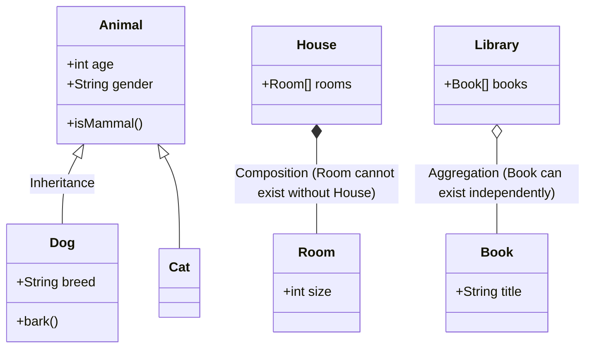
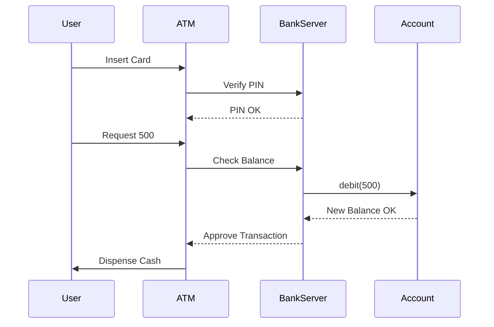

# UML Diagrams

Unified Modeling Language (UML) is a standard way to visualize the design of a system.

## 1. Class Diagram
The most common diagram in LLD. It shows the static structure of the system.

### Relationships
- **Inheritance**: Solid line with closed hollow arrow.
- **Implementation**: Dashed line with closed hollow arrow.
- **Association**: Solid line.
- **Aggregation**: Solid line with hollow diamond (◇).
- **Composition**: Solid line with filled diamond (◆).

## 2. Sequence Diagram
Shows how objects interact in a particular time sequence.

**Example**: ATM Withdrawal Process

## 3. Use Case Diagram
Show interactions between actors (users) and the system.

- **Actor**: Stick figure (User, Admin).
- **Use Case**: Oval (Login, Checkout).
- **System Boundary**: Box around use cases to define scope.
