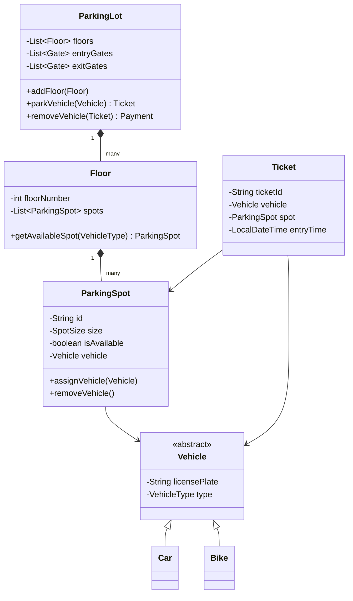

# Case Study: Parking Lot System

This is a **classic LLD interview question** asked at Amazon, Microsoft, Google, and other FAANG companies.

## Requirements

### Functional Requirements
1. Multiple floors, each floor has multiple slots.
2. Support different vehicle types: Car, Bike, Truck.
3. Different parking spot sizes: Compact, Large, Handicapped.
4. Entry/Exit gates with ticket generation.
5. Pricing strategy based on duration.
6. Display available slots per floor.

### Non-Functional Requirements
- Handle concurrent vehicles efficiently.
- Extensible to add new vehicle types or pricing.

---

## Design Approach

### 1. Identify Core Entities
- `ParkingLot`: The main system.
- `Floor`: Contains multiple parking spots.
- `ParkingSpot`: Individual slot.
- `Vehicle`: Car, Bike, Truck.
- `Ticket`: Generated at entry.
- `ParkingStrategy`: Algorithm to find available spot.

### 2. Class Diagram



---

## Code Implementation

### Enums
```java
enum VehicleType {
    CAR, BIKE, TRUCK
}

enum SpotSize {
    COMPACT, LARGE, HANDICAPPED
}

enum ParkingSpotStatus {
    AVAILABLE, OCCUPIED
}
```

### Vehicle Hierarchy
```java
abstract class Vehicle {
    protected String licensePlate;
    protected VehicleType type;
    
    public Vehicle(String licensePlate, VehicleType type) {
        this.licensePlate = licensePlate;
        this.type = type;
    }
    
    public VehicleType getType() { return type; }
    public String getLicensePlate() { return licensePlate; }
}

class Car extends Vehicle {
    public Car(String licensePlate) {
        super(licensePlate, VehicleType.CAR);
    }
}

class Bike extends Vehicle {
    public Bike(String licensePlate) {
        super(licensePlate, VehicleType.BIKE);
    }
}
```

### Parking Spot
```java
class ParkingSpot {
    private String id;
    private SpotSize size;
    private ParkingSpotStatus status;
    private Vehicle vehicle;
    
    public ParkingSpot(String id, SpotSize size) {
        this.id = id;
        this.size = size;
        this.status = ParkingSpotStatus.AVAILABLE;
    }
    
    public boolean isAvailable() {
        return status == ParkingSpotStatus.AVAILABLE;
    }
    
    public boolean canFitVehicle(Vehicle vehicle) {
        // Business logic: Bike can fit in any, Car in LARGE/COMPACT, etc.
        if (vehicle.getType() == VehicleType.BIKE) return true;
        if (vehicle.getType() == VehicleType.CAR && size != SpotSize.COMPACT) return true;
        return false;
    }
    
    public void assignVehicle(Vehicle vehicle) {
        this.vehicle = vehicle;
        this.status = ParkingSpotStatus.OCCUPIED;
    }
    
    public void removeVehicle() {
        this.vehicle = null;
        this.status = ParkingSpotStatus.AVAILABLE;
    }
    
    // Getters
    public String getId() { return id; }
    public SpotSize getSize() { return size; }
}
```

### Floor
```java
class Floor {
    private int floorNumber;
    private List<ParkingSpot> spots;
    
    public Floor(int floorNumber) {
        this.floorNumber = floorNumber;
        this.spots = new ArrayList<>();
    }
    
    public void addSpot(ParkingSpot spot) {
        spots.add(spot);
    }
    
    public ParkingSpot getAvailableSpot(Vehicle vehicle) {
        for (ParkingSpot spot : spots) {
            if (spot.isAvailable() && spot.canFitVehicle(vehicle)) {
                return spot;
            }
        }
        return null;
    }
    
    public int getAvailableCount() {
        return (int) spots.stream().filter(ParkingSpot::isAvailable).count();
    }
}
```

### Ticket
```java
class Ticket {
    private String ticketId;
    private Vehicle vehicle;
    private ParkingSpot spot;
    private LocalDateTime entryTime;
    
    public Ticket(Vehicle vehicle, ParkingSpot spot) {
        this.ticketId = UUID.randomUUID().toString();
        this.vehicle = vehicle;
        this.spot = spot;
        this.entryTime = LocalDateTime.now();
    }
    
    public long getDurationMinutes() {
        return ChronoUnit.MINUTES.between(entryTime, LocalDateTime.now());
    }
    
    // Getters
    public String getTicketId() { return ticketId; }
    public ParkingSpot getSpot() { return spot; }
    public Vehicle getVehicle() { return vehicle; }
}
```

### Parking Lot (Main Controller)
```java
class ParkingLot {
    private static ParkingLot instance;
    private List<Floor> floors;
    
    // Singleton
    private ParkingLot() {
        floors = new ArrayList<>();
    }
    
    public static synchronized ParkingLot getInstance() {
        if (instance == null) {
            instance = new ParkingLot();
        }
        return instance;
    }
    
    public void addFloor(Floor floor) {
        floors.add(floor);
    }
    
    public Ticket parkVehicle(Vehicle vehicle) {
        for (Floor floor : floors) {
            ParkingSpot spot = floor.getAvailableSpot(vehicle);
            if (spot != null) {
                spot.assignVehicle(vehicle);
                Ticket ticket = new Ticket(vehicle, spot);
                System.out.println("Vehicle parked at " + spot.getId());
                return ticket;
            }
        }
        System.out.println("No available spot");
        return null;
    }
    
    public double removeVehicle(Ticket ticket) {
        ParkingSpot spot = ticket.getSpot();
        spot.removeVehicle();
        
        // Calculate fee
        long duration = ticket.getDurationMinutes();
        double fee = calculateFee(duration, ticket.getVehicle().getType());
        
        System.out.println("Fee: $" + fee);
        return fee;
    }
    
    private double calculateFee(long minutes, VehicleType type) {
        // Simple pricing: $2/hour for cars, $1/hour for bikes
        double hourlyRate = (type == VehicleType.CAR) ? 2.0 : 1.0;
        return (minutes / 60.0) * hourlyRate;
    }
    
    public void displayAvailability() {
        for (int i = 0; i < floors.size(); i++) {
            System.out.println("Floor " + i + ": " + floors.get(i).getAvailableCount() + " spots available");
        }
    }
}
```

### Usage Example
```java
public class Main {
    public static void main(String[] args) {
        ParkingLot parkingLot = ParkingLot.getInstance();
        
        // Setup
        Floor floor1 = new Floor(1);
        floor1.addSpot(new ParkingSpot("A1", SpotSize.COMPACT));
        floor1.addSpot(new ParkingSpot("A2", SpotSize.LARGE));
        parkingLot.addFloor(floor1);
        
        // Park a car
        Vehicle car = new Car("ABC123");
        Ticket ticket = parkingLot.parkVehicle(car);
        
        parkingLot.displayAvailability();
        
        // Simulate some time passing
        try { Thread.sleep(2000); } catch (InterruptedException e) {}
        
        // Remove vehicle
        parkingLot.removeVehicle(ticket);
    }
}
```

---

## Key Takeaways
1. **Singleton** for ParkingLot ensures one instance.
2. **Strategy Pattern** can be used for different parking algorithms (Nearest, Random, etc.).
3. **OCP**: New vehicle types can be added without modifying existing code.
4. **SRP**: Each class has a single responsibility.
