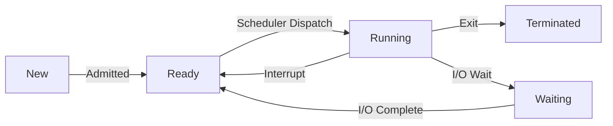

# Chapter 2: Process Management

## 2.1 The Process Concept
A process is a **program in execution**. A program is a passive entity (file on disk), while a process is an active entity (in memory).

### 2.1.1 Process Memory Layout
1.  **Text Section**: Compiled program code.
2.  **Data Section**: Global and static variables.
3.  **Heap**: Dynamically allocated memory (grows upward).
4.  **Stack**: Temporary data (Method params, return addresses, local variables) (grows downward).

### 2.1.2 Process Control Block (PCB)
The data structure used by the OS to manage a specific process. Also called **Task Control Block**.
*   **Process State**: (New, Ready, Running...)
*   **Program Counter (PC)**: Address of next instruction.
*   **CPU Registers**: Accumulators, Stack Pointer.
*   **CPU Scheduling Info**: Priority, Queue pointers.
*   **Memory Management Info**: Page tables, Limit registers.
*   **Accounting Info**: CPU time used, Clock time.
*   **I/O Status Info**: List of open files, devices.

---

## 2.2 Process State Context (The 5-State Model)

1.  **New**: Process is being moved from disk to memory.
2.  **Ready**: Waiting in the Ready Queue for CPU assignment.
3.  **Running**: Instructions are being executed.
4.  **Waiting (Blocked)**: Waiting for some event (I/O, Semaphore).
5.  **Terminated**: Execution finished, resources released.

*(Note: There are also **Suspended Ready** and **Suspended Wait** states in a 7-state model, involving swapping to disk).*

---

## 2.3 Context Switch
The process of saving the state (PCB) of the old process and loading the saved state of the new process.
*   **Overhead**: Pure overhead. System does no useful work while switching.
*   **Speed**: Depends on hardware support and complexity of OS (typically few microseconds).

---

## 2.4 Operations on Processes

### 2.4.1 Process Creation
*   **Parent** process creates **Child** processes (Tree structure).
*   **resource Sharing**: Parent shares all/subset/none of resources.
*   **Execution**: Concurrently or Parent waits.
*   **UNIX**:
    *   `fork()`: Creates generic copy of parent.
    *   `exec()`: Loads new binary into the child.

### 2.4.2 Process Termination
*   `exit()`: Normal termination.
*   `abort()`: Parent terminates child (e.g., Child exceeded resources).
*   **Zombie Process**: Child terminated, but Parent hasn't called `wait()` yet. Entry stays in process table.
*   **Orphan Process**: Parent terminated, Child is still running. In Linux, `init` (PID 1) adopts orphans.

---

## 2.5 Threads (Lightweight Processes)
A basic unit of CPU utilization.

### 2.5.1 Single vs Multi-Threaded
*   **Single**: Heavy. One flow of control.
*   **Multi**: Multiple concurrent flows sharing the same address space.

### 2.5.2 Shared vs Private Resources
| Shared (Process wide) | Private (Per Thread) |
| :--- | :--- |
| Code Section | Program Counter (PC) |
| Data Section (Globals) | Register Set |
| Heap Memory | Stack Memory |
| Open Files / Signals | Thread ID |

### 2.5.3 User Level vs Kernel Level Threads
1.  **User Threads (Library)**: Managed by user library (e.g., Java threads). Fast. Kernel sees 1 process. If 1 thread blocks, ALL block.
2.  **Kernel Threads (OS)**: Managed by OS. Slower creation. If 1 blocks, others can run. True Parallelism on Multi-core.

---

## 2.6 Inter-Process Communication (IPC)
Processes need to talk to each other.

### 2.6.1 Shared Memory
*   Region of memory shared by Cooperating Processes.
*   **Pros**: Fastest (Memory access speed).
*   **Cons**: Needs synchronization (Race Conditions).

### 2.6.2 Message Passing
*   Exchange messages via OS.
*   **Direct**: `send(P, message)`, `receive(Q, message)`.
*   **Indirect (Mailbox)**: `send(A, message)`, `receive(A, message)`.
*   **Pros**: No conflicts, easier for distributed systems.
*   **Cons**: Slower (System calls involved).
*   **Examples**: Pipes, Sockets, Message Queues.
